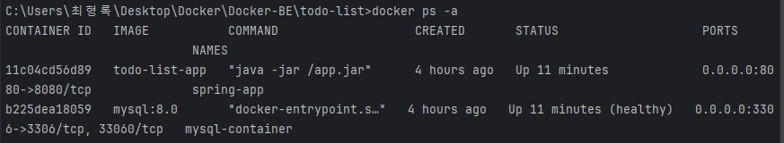
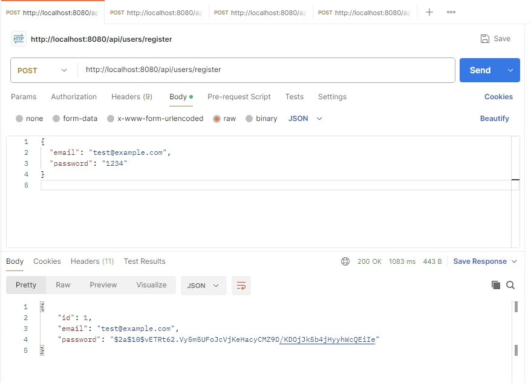
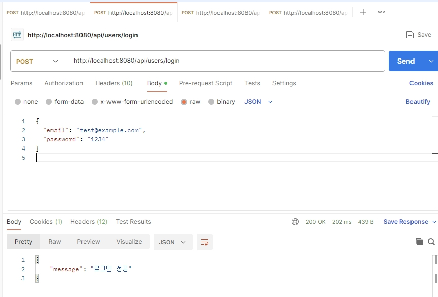

## 요구사항

### 1. 수행 조건

- 로컬 환경에서 `Docker`를 이용하여 서버를 띄웠습니다.
- `Spring Boot` 애플리케이션과 `MySQL` 모두 Docker 컨테이너로 구동하였습니다.

### 2. 과제 제출 조건

- `docker ps -a` 명령어 실행 결과를 캡처하여 첨부하였습니다.
- `Postman`을 이용해 회원가입 & 로그인 API 테스트 결과 캡처하여 첨부하였습니다.
 
---

## Docker 실행 결과

도커 컨테이너가 정상적으로 실행된 모습입니다.  
Spring 앱과 MySQL 모두 컨테이너로 잘 올라왔습니다.

---

## API 테스트 결과 (Postman)

### 회원가입 (Register)
`POST /api/users/register`  
이메일과 비밀번호를 전송하여 회원가입 성공하였습니다.

### 로그인 (Login)
`POST /api/users/login`  
로그인 성공 확인 가능합니다.

---

## 정리

- 도커로 Spring 서버 + MySQL 정상 실행됩니다.
- Postman으로 회원가입/로그인 테스트 성공하였습니다.
